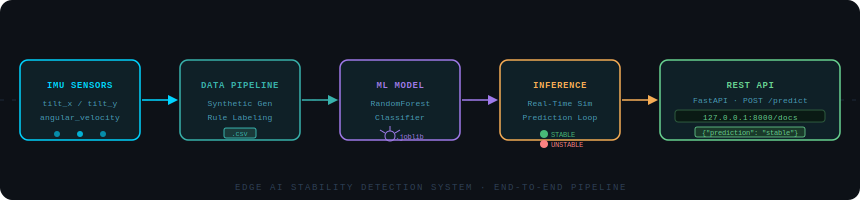

# Edge AI Stability Detection System

A machine learning system for detecting system stability using simulated IMU sensor data.  
The project demonstrates an end-to-end ML workflow including data generation, model training, real-time inference, and API deployment.

---

## Project Structure

```
stability-ai-system
│
├── data
│   └── synthetic_sensor_data.csv
│
├── training
│   └── train_model.py
│
├── model
│   └── stability_model.joblib
│
├── api
│   └── main.py
│
├── inference
│   └── realtime_predict.py
│
├── requirements.txt
└── README.md
```

---

## System Pipeline

```
Synthetic Sensor Data
        ↓
Data Processing
        ↓
Model Training (RandomForest)
        ↓
Model Evaluation
        ↓
Model Persistence (joblib)
        ↓
Real-Time Prediction Simulation
        ↓
REST API Deployment (FastAPI)
```

---

## Features

- Synthetic IMU-like sensor dataset generation
- RandomForest classifier for stability detection
- Real-time prediction simulation
- Model persistence using joblib
- REST API deployment using FastAPI

---

## Dataset

The dataset simulates IMU sensor readings including:

- `tilt_x`
- `tilt_y`
- `angular_velocity`

A rule-based labeling system determines whether the system is **stable or unstable**.

Example:

| tilt_x | tilt_y | angular_velocity | stable |
|------|------|------|------|
| 1.2 | -0.5 | 0.8 | 1 |
| 8.3 | -6.1 | 4.2 | 0 |

---

## Installation

Clone the repository:

```
git clone https://github.com/yourusername/stability-ai-system.git
cd stability-ai-system
```

Install dependencies:

```
pip install -r requirements.txt
```

---

## Train the Model

```
python training/train_model.py
```

This will:
- Generate the dataset
- Train the model
- Save the trained model to `model/stability_model.joblib`

---

## Real-Time Prediction Simulation

Run:

```
python inference/realtime_predict.py
```

Example output:

```
TiltX:1.20 TiltY:-0.40 AV:0.80 -> STABLE
TiltX:7.50 TiltY:6.20 AV:3.90 -> UNSTABLE
```

---

## API Deployment

Run the FastAPI server:

```
uvicorn api.main:app --reload
```

Open the API documentation:

```
http://127.0.0.1:8000/docs
```

---

## API Example

POST `/predict`

Input:

```
{
 "tilt_x": 1.2,
 "tilt_y": -0.3,
 "angular_velocity": 0.7
}
```

Output:

```
{
 "prediction": "stable"
}
```

---

## System Pipeline



## Future Improvements

- Integration with real IMU sensors (MPU6050)
- Deep learning time-series models
- Edge deployment on embedded devices
- Logging and monitoring system

---

## Author

Aaradhya Dev Tamrakar  
Electronics, Communication & Information Engineering  
IOE – Tribhuvan University